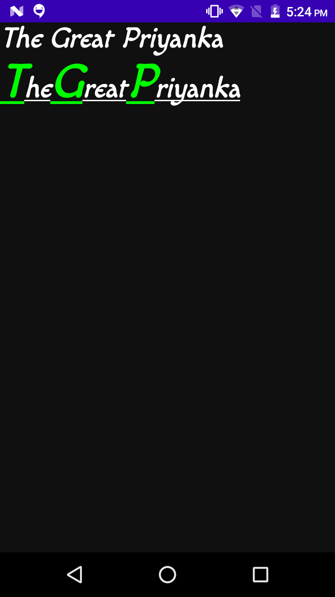

# Styling Text With JetPackCompose

## Font used
####
#### Here i have used font provided by google fonts named [macondo_regular](https://fonts.google.com/specimen/Macondo?preview.size=32) .
#### if you want you can use any font provided

## Output 

## Key Learnings
> 1. FontFamily -: you can diffren
> 2. buildAnnotatedString
> 3. withStyle
> 4. textDecoration

## Learning Source
I Learned above topic from [youtube](https://www.youtube.com/watch?v=nm_LNJWHi9A&list=PLQkwcJG4YTCSpJ2NLhDTHhi6XBNfk9WiC)

