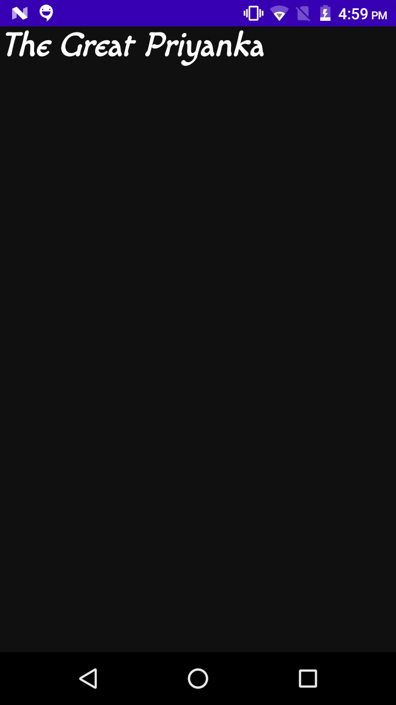

# Styling Text With Compose

## Font used
####
Here i have used font provided by google fonts named [macondo_regular].(https://fonts.google.com/specimen/Macondo?preview.size=32) .
if you want you can use any font provided

## Output 

